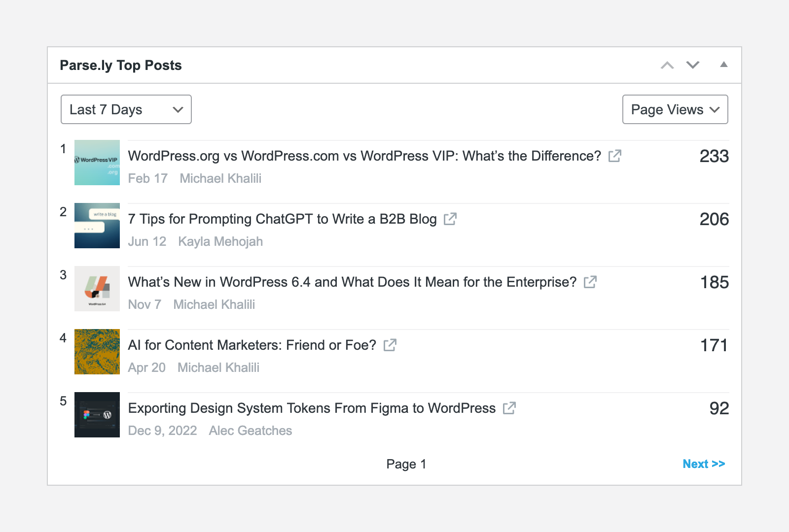
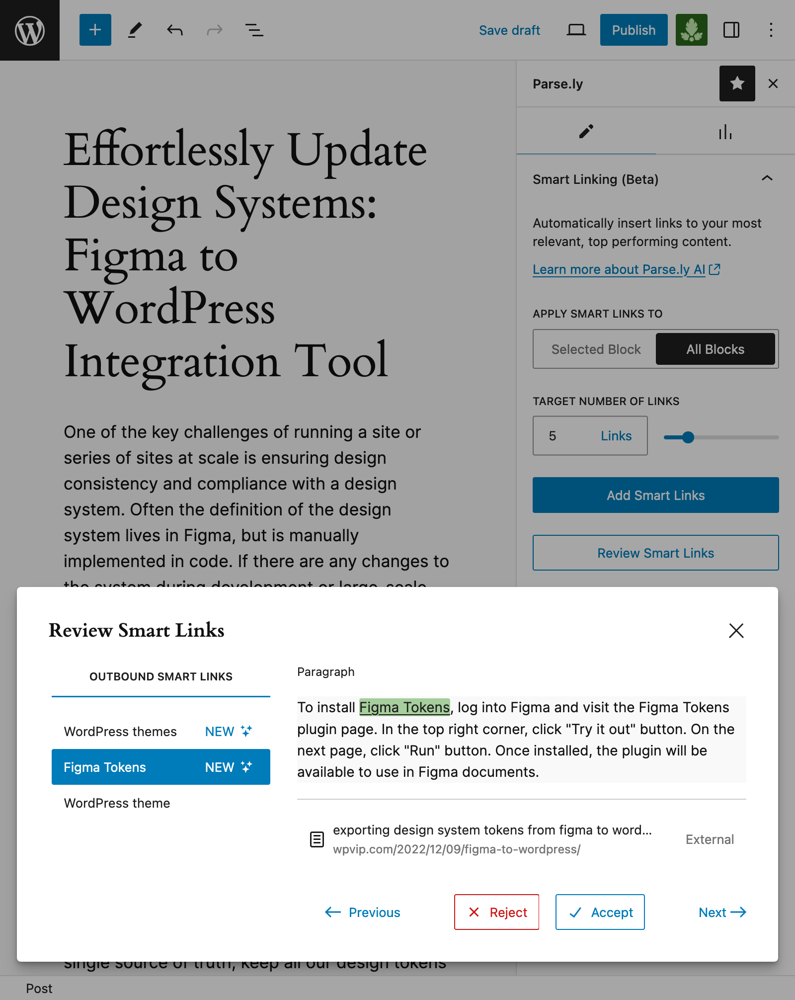
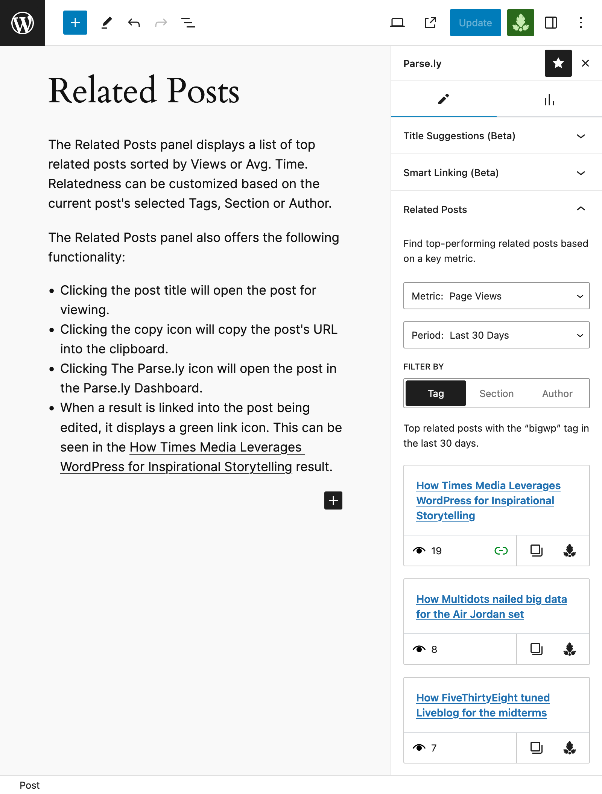
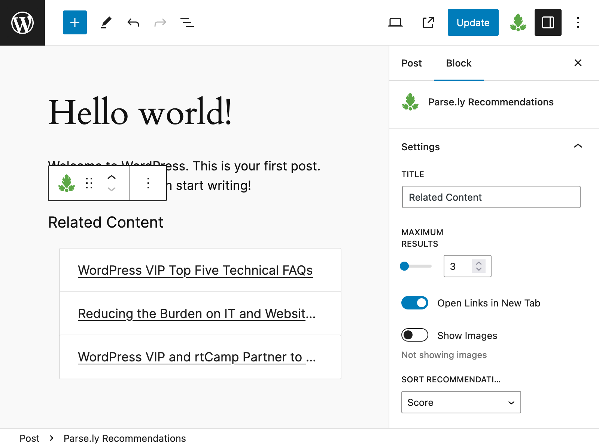

# Parse.ly

Stable tag: 3.13.3  
Requires at least: 5.2  
Tested up to: 6.4  
Requires PHP: 7.2  
License: GPLv2 or later  
License URI: https://www.gnu.org/licenses/gpl-2.0.html  
Tags: analytics, statistics, stats, content marketing, parsely, parsley, parse.ly  
Contributors: parsely, hbbtstar, jblz, mikeyarce, GaryJ, parsely_mike, acicovic, mehmoodak, vaurdan

The Parse.ly plugin facilitates real-time and historical analytics to your content through a platform designed and built for digital publishing.

## Description

Designed and built for digital publishers, Parse.ly helps you understand how your audience is connecting to your content.

Thousands of writers, editors, site managers, and technologists already use Parse.ly to understand what content draws in website visitors, and why. Using our powerful dashboards and APIs, customers build successful digital strategies that allow them to grow and engage a loyal audience.

Join industry leaders -- like NBA, Slate, News Corp, and Conde Nast -- who already use Parse.ly to bring clarity to content, audience, and analytics.

Feedback, suggestions, questions or concerns? Open a new [GitHub issue](https://github.com/Parsely/wp-parsely/issues) or email us at [support@parsely.com](mailto:support@parsely.com). We always want to hear from you!

**NOTE:** The plugin requires an active Parse.ly account. [Sign up for a free Parse.ly demo](https://www.parsely.com/getdemo?utm_medium=referral&utm_source=wordpress.org&utm_content=wp-parsely).

### Features

The wp-parsely plugin is packed with features that allow for a seamless integration process, and brings the power of the Parse.ly dashboard into WordPress.

#### Automated integration

The plugin automatically inserts the Parse.ly metadata and JavaScript in all published pages and posts (Custom Post Types are supported). It also provides a settings page to customize your integration, with options including:
- Output Parse.ly metadata as [JSON-LD](https://docs.parse.ly/metadata-jsonld/) or [repeated meta tags](https://docs.parse.ly/metatags/).
- Choose whether logged-in users should be tracked.
- Define how to track every Post Type (as Post, Non-Post or no tracking).

#### The Parse.ly Content Helper

The [Content Helper](https://docs.parse.ly/plugin-content-helper/) is a set of content insight tools including:
- The [Parse.ly Dashboard Widget](https://docs.parse.ly/plugin-content-helper/#h-dashboard) - Displays the site's top posts in the WordPress Dashboard.
- The [Parse.ly Stats Column](https://docs.parse.ly/plugin-content-helper/#h-posts) - Displays published post performance for the last 7 days in Post Lists.
- The [Parse.ly Editor Sidebar](https://docs.parse.ly/plugin-content-helper/#h-editor) - This sidebar is integrated into the WordPress Editor and offers insights about the content currently being edited such as:
  - [Performance Details](https://docs.parse.ly/plugin-content-helper/#h-performance-details) - Displays performance metrics about the content currently being edited.
  - [Related Top Posts](https://docs.parse.ly/plugin-content-helper/#h-related-top-posts) - Displays a list of the website’s most successful posts, similar to the post/page currently being edited.
  - [Title Suggestions](https://docs.parse.ly/plugin-content-helper/#h-title-suggestions-beta) - Generates title suggestions for the post/page currently being edited.
- The [Parse.ly Excerpt Generator](https://docs.parse.ly/plugin-content-helper/#h-excerpt-generator-beta) - A Post Editor settings enhancement that generates an excerpt for the post/page currently being edited.

#### The Parse.ly Recommendations Block

The plugin includes a [Recommendations Block](https://docs.parse.ly/recommendations-block/) that displays a list of posts related to the currently viewed post/page. The Block is useful for showcasing related content to visitors, and it can also be used in Site Editing mode or as a [Block-based Widget](https://wordpress.org/documentation/article/block-based-widgets-editor/). 

#### Advanced integrations support

While the plugin works out of the box for basic integrations, it offers a host of features that easily allow for advanced integration scenarios:
- Support for [Google Tag Manager, AMP, Google Web Stories and Cloudflare](https://docs.parse.ly/plugin-common-questions/#h-is-wp-parsely-compatible-with-amp-facebook-instant-articles-or-google-web-stories) is included.
- The plugin exposes the `wpParselyOnLoad` and `wpParselyOnReady` JavaScript hooks that allow for advanced integrations requiring JavaScript, such as [Dynamic Tracking](https://docs.parse.ly/plugin-dynamic-tracking/).
- Support for WordPress [network/multisite](https://docs.parse.ly/plugin-common-questions/#h-is-wp-parsely-compatible-with-wordpress-network-multisite) and [decoupled/headless](https://docs.parse.ly/plugin-decoupled-headless-support/) (GraphQL and WP Rest API) setups is included.
- Last but not least, a wide range of hooks is available in order to customize the plugin's functionality even further.

### Documentation and resources

- [Plugin Documentation](https://docs.parse.ly/wordpress-plugin-setup/).
- [Commonly Asked Questions](https://docs.parse.ly/plugin-common-questions/).
- [Changelog](https://github.com/parsely/wp-parsely/blob/trunk/CHANGELOG.md).

**IMPORTANT:** If you are a [WordPress VIP](https://wpvip.com/) customer, please consult the [WordPress VIP documentation](https://docs.wpvip.com/parse-ly/) for more details.

### Sample Parse.ly metadata

The standard Parse.ly JavaScript tracker inserted before the closing `body` tag:

~~~html

~~~

A sample `JSON-LD` structured data for a home page or section page:

~~~html

~~~

A sample `JSON-LD` meta tag and structured data for an article or post:

~~~html

~~~

### Contributing

Development, code hosting and issue tracking of this plugin happens on the [wp-parsely GitHub repository](https://github.com/Parsely/wp-parsely/). Active development happens on the `develop` branch and releases are made off the `trunk` branch.

To run the plugin locally or to contribute to it, please check the instructions in the [CONTRIBUTING](https://github.com/Parsely/wp-parsely/blob/develop/docs/CONTRIBUTING.md) file.

## Installation

The plugin requires an active Parse.ly account. [Sign up for a free demo of Parse.ly](https://www.parsely.com/getdemo?utm_medium=referral&utm_source=wordpress.org&utm_content=wp-parsely).

For more information, please visit the [installation instructions](https://docs.parse.ly/wordpress-plugin-setup/) in the official documentation. 

## Frequently Asked Questions

Please visit the [Commonly Asked Questions page](https://docs.parse.ly/plugin-common-questions/) in the official documentation.

## Changelog

Please visit the [changelog](https://github.com/parsely/wp-parsely/blob/trunk/CHANGELOG.md).

## Screenshots

1. The Parse.ly Dashboard Widget, showing the website's top posts.  
   
2. The Parse.ly Stats Column (on the right), showing information about content that is being tracked as Posts.  
   
3. The Parse.ly Editor Sidebar, featuring the Performance Details panel.  
   
4. The Parse.ly Editor Sidebar, featuring the Related Top Posts panel.  
   
5. The Parse.ly Editor Sidebar, featuring the Title Suggestions panel.  
   
6. The Parse.ly Excerpt Generator in the Post Editor's settings.  
   
7. The Recommendations Block, showcasing links to related content on your site.  
   
8. Parse.ly plugin basic settings for easy setup. For the plugin to start working, only the Site ID is needed.  
   
9. Parse.ly plugin settings that require a website recrawl whenever they are updated.  
   
10. Parse.ly plugin advanced settings, to be used only if instructed by Parse.ly staff.  
   
11. A view of the Parse.ly Dashboard Overview. Parse.ly offers analytics that empower you to better understand how your content is performing.  
   
